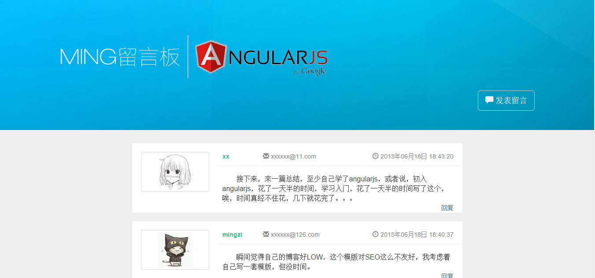

# comment / Angularjs留言板
#### 路由，视图，分页，数据请求，数据输出，都是用AngularJs实现的。
###### 访问地址：[MING留言板](http://www.jmingzi.cn/demo/comment/src)

*********************************************

- * 在这里顺便联系一下Markdown语法格式；  
- * 这个留言板没有用到指令，用到了自定义过滤器 * 
- * 没有用到AngularJs-UI，在写的时候大多参考官方API文档；

============================================

==== 入口文件  
- app.js   
	/*
	*这是一个入口文件，依赖注入了其它模块  
	*/  
	var LiuYanBan = angular.module('LiuYanBan', ['ngRoute', 'listM', 'liuYan']);  
	
	// LiuYanBan.directive('list', function(){
	// 	return {
	// 		restrict: 'E',
	// 		replace : true,
	// 		transclude: true,
	// 		template: '
Hi there
',
	// 		link : function(scope, element, attrs){
	// 			alert(element);
	// 		}
	// 	};
	// });  
	LiuYanBan.config(function($routeProvider){
		$routeProvider.when('/index', {
			templateUrl : 'tpl/list.html',
			controller : "listCtrl"
			})
		.when('/form', {
			templateUrl : "tpl/form.html",
			controller : "formCtrl"
		})
		.when('/replay/:cid/:name', {
			templateUrl : "tpl/form.html",
			controller : "formCtrl"
		})
		.otherwise({
			redirectTo: "/index"
		})
	});
